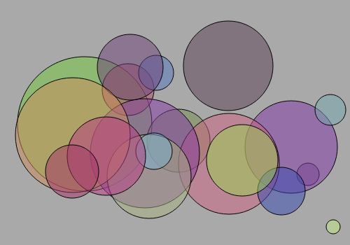
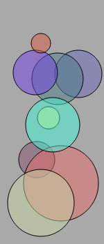
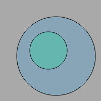
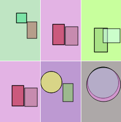
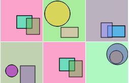
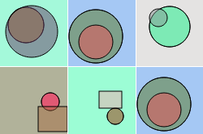

# Captcha/ReCaptcha в формате SVG

## Captcha с кругами

 \
 


## Пример использования

```php
$captcha = new CaptchaSVG();
echo $captcha->create();
```

В класс можно передать следующие параметры:

``width`` - ширина экрана (по умолчанию - 200) \
``height`` - высота экрана (по умолчанию - 200)\
``maxCountCircles`` - количество кругов (по умолчанию - 8)\

Методы:

```php
$captcha->getCountCircles()
```
Возвращает количество кругов на картинке

```php
$captcha->setWidth()
```
Устанавливает ширину captcha 

```php
$captcha->setHeight();
```
Устанавливает высоту captcha

```php
$captcha->setCountCircles();
```
Устанавливает количество кругов на captcha

## ReCaptcha





## Пример использования

```php
$recaptcha = new ReCaptchaSVG();
echo $recaptcha->create();
```

В класс можно передать следующие параметры:

``$recaptchaWidth`` - ширина ``<div id="recaptcha">``\
``$height`` - высота одного элемента SVG\
``$correlationWidthHeight`` - соотношение ширины и высоты (``$width / $height``)\
``$countElementsOnImage`` - количество элементов на одном элементе SVG

Методы:

```php
$recaptcha->getIndexesRepeatImages();
```

Возвращает массив индексов с повторяющимися картинками

```php
$recaptcha->setStyleForDivReCaptcha($style, $class);
```

Устанавливает стили для ``<div id="recaptcha">``\
``$style`` - принимает строку стилей для div или класс CSS, чтобы использовать класс CSS, нужно установить ``$class = true``

```php
$recaptcha->setCorrelationWidthHeight($height);
```

Устанавливает новое соотношение ширины и высоты

```php
$recaptcha->setCountElementsOnImage($countElementsOnImage);
```

Устанавливает количество элементов на одном элементе SVG

```php
$recaptcha->setRecaptchaWidth($width);
```

Устанавливает ширину ``<div id="recaptcha">``

```php
$recaptcha->setCountElementsOnReCaptcha($countElementsOnReCaptcha);
```

Устанавливает количество SVG-элементов в ``<div id="recaptcha">``